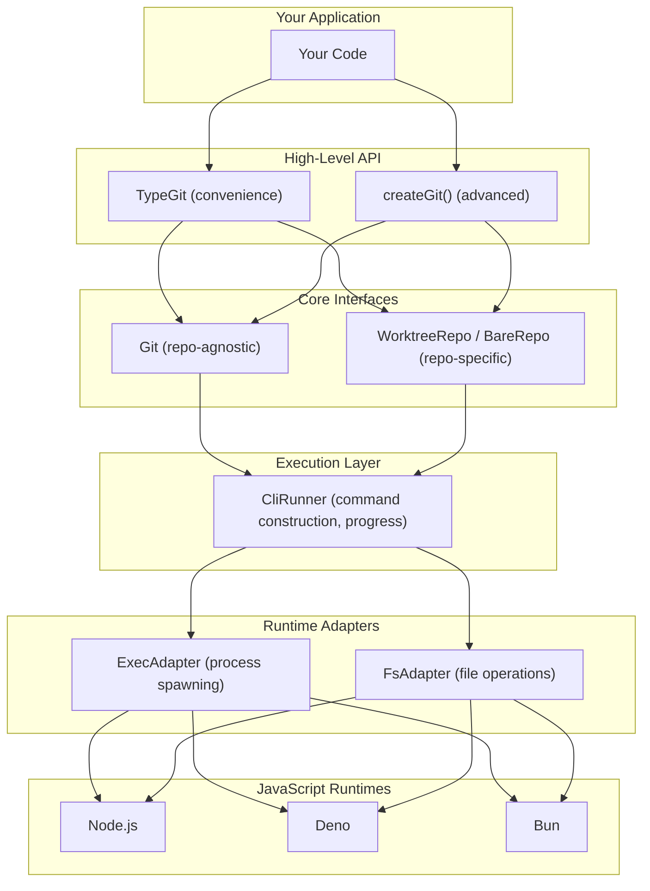
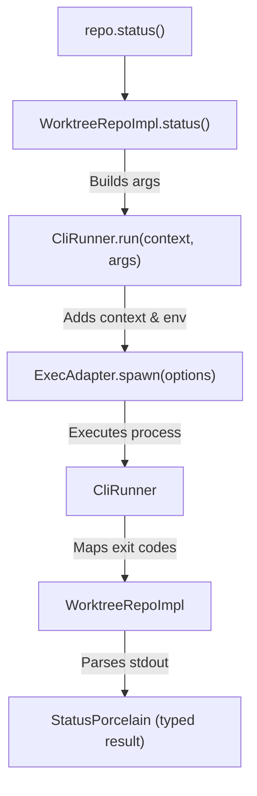

## Design Overview

type-git is designed with three key principles:

1. **Context Separation** - Clear distinction between repository-agnostic and repository-specific operations
2. **Runtime Abstraction** - Support for Node.js, Deno, and Bun through adapters
3. **Layered API** - Three levels of abstraction for different use cases



## Context Separation

type-git separates operations based on whether they require a repository context.

### Git (Repository-Agnostic)

Operations that don't need an existing repository:

```typescript
const git = new TypeGit();

// These work without opening a repository
await git.clone(url, path);      // Clone remote repo
await git.init(path);            // Create new repo
await git.lsRemote(url);         // List remote refs
await git.version();             // Get git version
await git.raw(['help']);         // Run any git command
```

### Repo (Repository-Specific)

Operations that require a repository context:

```typescript
const repo = await git.open('./my-repo');

// These require a repository
await repo.status();
await repo.commit({ message: 'feat: add feature' });
await repo.branch.create('feature-x');
await repo.push();
```

### WorktreeRepo vs BareRepo

type-git distinguishes between standard and bare repositories:

```typescript
// Standard repository (has working directory)
const worktree = await git.open('./repo');
worktree.workdir;  // '/path/to/repo'
await worktree.status();
await worktree.add(['file.txt']);

// Bare repository (no working directory)
const bare = await git.open('./repo.git');
bare.gitDir;  // '/path/to/repo.git'
await bare.fetch();
await bare.push();
// bare.status()  // Not available - no working directory
```

## Three-Layer API

type-git provides three levels of abstraction:

### 1. Raw API

Direct access to git commands with unprocessed output:

```typescript
// Returns { stdout, stderr, exitCode }
const result = await repo.raw(['log', '--oneline', '-5']);
console.log(result.stdout);
```

Use when:
- You need output that isn't covered by typed APIs
- You want to process output yourself
- You're running custom git commands

### 2. Typed API

Parsed, type-safe output for common operations:

```typescript
// Returns typed StatusPorcelain object
const status = await repo.status();
for (const entry of status.entries) {
  console.log(entry.path, entry.index, entry.workdir);
}

// Returns typed Commit array
const commits = await repo.log({ maxCount: 10 });
for (const commit of commits) {
  console.log(commit.hash, commit.subject);
}
```

Use when:
- You want structured data
- You need type safety
- Output format is predictable (porcelain, JSON)

### 3. High-Level API

Convenience methods for common workflows:

```typescript
// Branch operations
await repo.branch.create('feature-x');
await repo.branch.delete('old-branch');

// Stash operations
await repo.stash.push({ message: 'WIP' });
await repo.stash.pop();

// Tag operations
await repo.tag.create('v1.0.0', { message: 'Release 1.0' });
```

Use when:
- You want a clean, intuitive API
- You're doing common git operations
- You prefer method chaining style

## Runtime Abstraction

type-git abstracts runtime-specific code through adapters.

### Why Adapters?

Different JavaScript runtimes have different APIs:

| Operation | Node.js | Deno | Bun |
|-----------|---------|------|-----|
| Spawn process | `child_process.spawn` | `Deno.Command` | `Bun.spawn` |
| Read file | `fs.readFile` | `Deno.readTextFile` | `Bun.file().text()` |
| Temp file | `os.tmpdir()` + `fs` | `Deno.makeTempFile` | `Bun.file` |

### Adapter Architecture

```typescript
interface ExecAdapter {
  spawn(options: SpawnOptions): Promise<SpawnResult>;
  getCapabilities(): Capabilities;
}

interface FsAdapter {
  createTempFile(): Promise<string>;
  deleteFile(path: string): Promise<void>;
  tail(options: TailOptions): Promise<void>;
  // ...
}

interface RuntimeAdapters {
  exec: ExecAdapter;
  fs: FsAdapter;
}
```

### Pre-configured Classes

Each runtime has a pre-configured `TypeGit` class:

```typescript
// Node.js
import { TypeGit } from 'type-git/node';

// Deno
import { TypeGit } from 'npm:type-git/deno';

// Bun
import { TypeGit } from 'type-git/bun';
```

These automatically configure the correct adapters for your runtime.

## Command Execution Flow

When you call a git operation:



## No `cwd` Dependency

type-git uses `git -C <path>` instead of changing the working directory:

```typescript
// type-git internally runs:
// git -C /path/to/repo status

// Not:
// cd /path/to/repo && git status
```

Benefits:
- Thread-safe (no global state)
- Predictable behavior
- Works in any execution context
